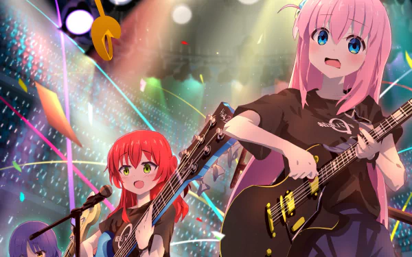
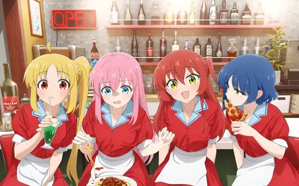

<p align="center">
  
</p>

# Ryo Yamada — Premium WhatsApp Bot 🎸
> **The quiet bassist of Kessoku Band, now managing your WhatsApp groups, economy, and AI interactions.**

<p align="center">
  
  
  
  
</p>

---

### 🍱 Kessoku Team
Managing your digital world with a touch of rock.

<p align="center">
  
  
  
  
</p>

---

### 🚀 Core Capabilities

#### 🛡️ Administration & Guard (Nijika Mode)
*   **Wistoria Guard**: Advanced protection against unauthorized promotions and media.
*   **Anti-Link & Anti-Bot**: Keeps your groups clean from spam and bots.
*   **Auto-Welcome**: Stylish character-themed welcome cards.

#### 🎥 Media Studio (Ryo Mode)
*   **4K Upscaling**: Professional image enhancement at your fingertips.
*   **Sticker Studio**: Instant transformation of images/videos to HD stickers.
*   **Media Downloader**: Smooth YouTube, TikTok, and Instagram content retrieval.

#### 🤖 AI & Social (Bocchi Mode)
*   **Deep AI**: Chat with Gemini, Llama 3, and specialized character bots.
*   **RPG Engine**: Experience points, marriage system, and detailed profiles.
*   **Social Interactions**: Hugs, kisses, slaps—fully interactive social commands.

#### 🎰 Economy & Games (Kita Mode)
*   **Full Economy**: Bank, work, mining, and a bustling market.
*   **Arena & Gacha**: Collect crew members and battle for glory.
*   **Live Games**: Tic-Tac-Toe, Hangman, and Puzzle Box integrated into chat.

---

### 🎸 Visual Experience
<p align="center">
  
</p>

---

### 📂 Repository Overview
```bash
├── main.js             # Runtime Message Processing
├── commands/           # Command Modules (290+)
├── lib/               # Security, Guards & Stores
└── data/              # Bot State & JSON Data
```

### 📎 Quick Navigation
- [Project Overview](./context/PROJECT_OVERVIEW.md)
- [Architecture](./context/ARCHITECTURE.md)
- [Deployment Guide](./context/DEPLOYMENT.md)

---
<p align="center">
  <b>Built with 💙 for the Kessoku Band Community</b><br>
</p>
